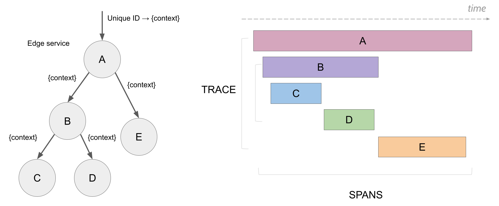
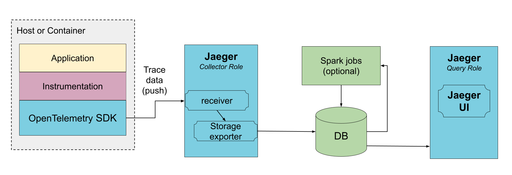
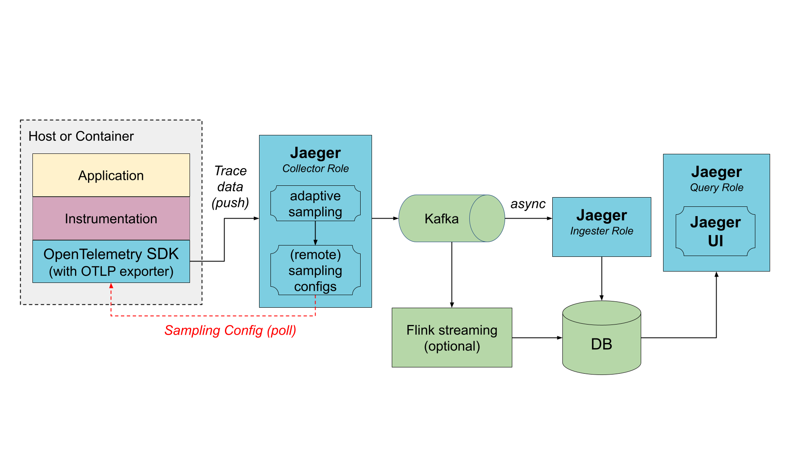
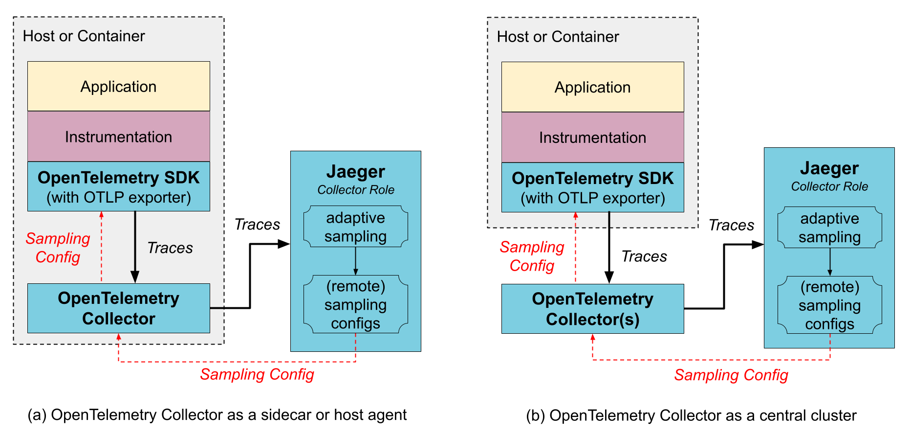
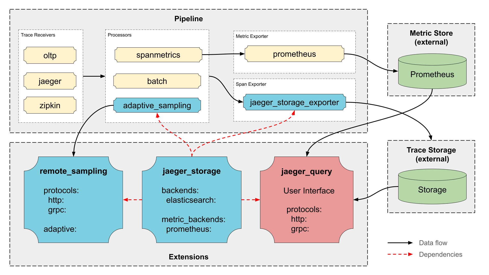

# Jaeger

## About Jaeger

Jaeger is a distributed tracing platform released as open source by Uber Technologies in 2016 and donated to Cloud Native Computing Foundation where it is a graduated project.

With Jaeger you can:

- Monitor and troubleshoot distributed workflows
- Identify performance bottlenecks
- Track down root causes
- Analyze service dependencies

## Relationship with OpenTelemetry

The Jaeger and OpenTelemetry  projects have different goals. OpenTelemetry aims to provide APIs and SDKs in multiple languages to allow applications to export various telemetry data out of the process, to any number of metrics and tracing backends. The Jaeger project is primarily the tracing backend that receives tracing telemetry data and provides processing, aggregation, data mining, and visualizations of that data.

## Getting Started

### All-in-one

The easiest way to run Jaeger is by starting it in a container:

```bash
docker run --rm --name jaeger \
  -p 16686:16686 \
  -p 4317:4317 \
  -p 4318:4318 \
  -p 5778:5778 \
  -p 9411:9411 \
  jaegertracing/jaeger:2.5.0
```

This runs the all-in-one configuration of Jaeger that combines collector and query components in a single process and uses a transient in-memory storage for trace data. You can navigate to http://localhost:16686 to access the Jaeger UI.

In order to run Jaeger in other roles, an explicit configuration file must be provided via the --config command line argument. When running in a container, the path to the config file must be mapped into the container file system (the -v ... mapping below):

```bash
docker run --rm --name jaeger \
  -p 16686:16686 \
  -p 4317:4317 \
  -p 4318:4318 \
  -p 5778:5778 \
  -p 9411:9411 \
  -v /path/to/local/config.yaml:/jaeger/config.yaml \
  jaegertracing/jaeger:2.5.0 \
  --config /jaeger/config.yaml
```

> [!WARN]
>
> Your applications must be instrumented before they can send tracing data to Jaeger. We recommend using the OpenTelemetry  instrumentation and SDKs.

## Features

- High Scalability
- Cloud Native
- OpenTelemetry
- Multiple storage backends
- Sampling
- Modern Web UI
- Observability
- Topology Graphs
- System Architecture
- Deep Dependency Graph
- Service Performance Monitoring (SPM)
- Zipkin Compatibility

## Terminology

Jaeger represents tracing data in a data model inspired by the OpenTracing Specification . The data model is logically very similar to OpenTelemetry Traces , with some naming differences:

| Jaeger          | OpenTelemetry | Notes                                                                                                                                                                          |
| --------------- | ------------- | ------------------------------------------------------------------------------------------------------------------------------------------------------------------------------ |
| Tags            | Attributes    | Both support typed values, but nested tags are not supported in Jaeger.                                                                                                        |
| Span Logs       | Span Events   | Point-in-time events on the span recorded in a structured form.                                                                                                                |
| Span References | Span Links    | Jaeger’s Span References have a required type (child-of or follows-from) and always refer to predecessor spans; OpenTelemetry’s Span Links have no type, but allow attributes. |
| Process         | Resource      | A struct describing the entity that produces the telemetry.                                                                                                                    |

### Span

A span represents a logical unit of work that has an operation name, the start time of the operation, and the duration. Spans may be nested and ordered to model causal relationships.



### Trace

A trace represents the data or execution path through the system. It can be thought of as a directed acyclic graph of spans.

### Baggage

Baggage is arbitrary user-defined metadata (key-value pairs) that can be attached to distributed context and propagated by the tracing SDKs.

## Architecture

Jaeger v2 is designed to be a versatile and flexible tracing platform. It can be deployed as a single binary that can be configured to perform different **roles** within the Jaeger architecture, such as:

- **collector**: Receives incoming trace data from applications and writes it into a storage backend.
- **query**: Serves the APIs and the user interface for querying and visualizing traces.
- **ingester**: Ingests spans from Kafka and writes them into a storage backend; useful when running in a split collector-Kafka-ingester configuration.
- **all-in-one**: Collector and query roles in a single process.
- **agent**: A host agent or a sidecar that runs next to the application and forwards trace data to the collector. While Jaeger can be configured for this role, we recommend using the standard OpenTelemetry Collector  instead because you may likely need it to process other types of telemetry (metrics & logs).

Choosing between the **all-in-one** and the **collector/query** configurations is a matter of preference. When using external storage backend, both configurations are horizontally scalable, but the **collector/query** configuration allows to separate the read and write traffic and to scale them independently, as well as to apply different access and security policies.

The **all-in-one** configuration with in-memory storage is most suitable for development and testing, but it is not recommended for production since the data is lost on restarts. **all-in-one** with the Badger backend can be used in production, but only for modest data volumes since it is limited to a single instance and cannot be scaled horizontally.

### Architecture choices

The two most common deployment options for a scalable Jaeger backend are direct-to-storage and using Kafka as a buffer.

### Direct to storage

In this deployment the collectors receive the data from traced applications and write it directly to storage. The storage must be able to handle both average and peak traffic. The collectors may use an in-memory queue to smooth short-term traffic peaks, but a sustained traffic spike may result in dropped data if the storage is not able to keep up.



### Via Kafka

To prevent data loss between collectors and storage, Kafka can be used as an intermediary, persistent queue. The collectors are configured with Kafka exporters. An additional component, ingester, needs to be deployed to read data from Kafka and save it to storage. Multiple ingesters can be deployed to scale up ingestion; they will automatically partition the load across them. In practice, an ingester is very similar to a collector, only configured with a Kafka receiver instead of RPC-based receivers.



### With OpenTelemetry Collector

You do not need to use the OpenTelemetry Collector to operate Jaeger, because Jaeger is a customized distribution of the OpenTelemetry Collector with different roles. However, if you already use the OpenTelemetry Collectors, for gathering other types of telemetry or for pre-processing / enriching the tracing data, it can be placed in front of Jaeger in the collection pipeline. The OpenTelemetry Collectors can be run as an application sidecar, as a host agent / daemon, or as a central cluster.

The OpenTelemetry Collector supports Jaeger’s Remote Sampling protocol and can either serve static configurations from config files directly, or proxy the requests to the Jaeger backend (e.g., when using adaptive sampling).



#### OpenTelemetry Collector as a sidecar / host agent

Benefits:

- The SDK configuration is simplified as both trace export endpoint and sampling config endpoint can point to a local host and not worry about discovering where those services run remotely.
- Collector may provide data enrichment by adding environment information, like k8s pod name.
- Resource usage for data enrichment can be distributed across all application hosts.

Downsides:

- An extra layer of marshaling/unmarshaling the data.

#### OpenTelemetry Collector as a remote cluster

- Benefits:

- Sharding capabilities, e.g., when using tail-based sampling .

Downsides:

- An extra layer of marshaling/unmarshaling the data.

### Jaeger Binary

The Jaeger binary is build on top of the OpenTelemetry Collector framework and includes:

- Official upstream components, such as OTLP Receiver, Batch and Attribute Processor, etc.
- Upstream components from opentelemetry-collector-contrib, such as Kafka Exporter and Receiver, Tail Sampling Processor, etc.
- Jaeger own components, such as Jaeger Storage Exporter, Jaeger Query Extension, etc.



### Jaeger Components

- Jaeger Storage Extension  - Extensible hub for storage backends supported in Jaeger. It provides all other Jaeger components access to Jaeger storage implementations.
- Jaeger Storage Exporter  - Writes spans to storage backend configured in the Jaeger Storage Extension.
- Jaeger Query Extension  - Run the query APIs and the Jaeger UI.
- Adaptive Sampling Processor  - Performs probabilities calculations for adaptive sampling.
- Remote Sampling Extension  - Serves the endpoints for Remote Sampling, based on static configuration file or adaptive sampling.

### OpenTelemetry Components

#### Receivers

- **OTLP**  - Accepts spans sent via OpenTelemetry Line Protocol (OTLP).
- **Jaeger**  - Accepts Jaeger formatted traces transported via gRPC or Thrift protocols.
- **Kafka**  - Accepts spans from Kafka in various formats (OTLP, Jaeger, Zipkin).
- **Zipkin**  - Accepts spans using Zipkin v1 and v2 protocols.

#### Processors

- **Batch**  - Batches spans for better efficiency.
- **Tail Sampling**  - Supports advanced post-collection sampling.
- **Memory Limiter**  - Supports back-pressure when the collector is overloaded.
- **Attributes**  - Allows filtering, rewriting, and enriching spans with attributes. Can be used to redact sensitive data, reduce data volume, or attach environment information.

#### Exporters

- **OTLP**  - Send data in OTLP format via gRPC.
- **OTLP HTTP**  - Sends data in OTLP format over HTTP.
- **Kafka**  - Sends data to Kafka in various formats (OTLP, Jaeger, Zipkin).
- **Prometheus**  - Sends metrics to Prometheus.
  Debug  - Debugging tool for pipelines.

#### Connectors

- **Span Metrics**  - Generates metrics from span data.
- **Forward**  - Redirects telemetry between pipelines in the collector (ex: span to metric / span to log)

#### Extensions

- **Health Check v2**  - Supports health checks.
- **zPages**  - Exposes internal state of the collector for debugging.

## Sampling

Sampling is essential when handling large volumes of traces. Sampling helps to control both the overhead on the applications producing traces, and the storage and processing costs for trace data. Ideally, sampling aims to discard less interesting data and keep the data needed to diagnose issues.

Jaeger supports multiple types of sampling strategies.

### Head Based Sampling

Head based sampling is when the sampling decision is made at the beginning of a trace. The support for head based sampling is built into the OpenTelemetry SDKs.

### Tail Based Sampling

Tail based sampling allows for the sampling decisions to be made after the trace is complete and all spans have been collected. This provides more granular control over which traces and kept and which are discarded. The downsides to this are (a) the runtime overhead on the application that must record and export all traces, and (b) the higher memory and processing costs for the Jaeger backend.

### Remote Sampling

Remote sampling is a form of head-based sampling where the configuration for the sampling strategy is retrieved by the SDKs from the Jaeger backend. It allows consolidating the sampling policies in one central location and simplifying the management of the SDKs running in large scale production systems.

Jaeger’s remote_sampling extension supports Jaeger’s remote sampling protocol that defines sampling strategies as distinct sampling rates for each service and endpoint. The strategies can be generated by Jaeger in two different ways: periodically loaded from a file or dynamically calculated based on traffic.

These are two basic types of head samplers that are used by the remote sampling:

- **Probabilistic** sampler makes a random sampling decision with a pre-configured probability. For example, with probability=0.1 approximately 1 in 10 traces will be sampled.
- **Rate Limiting** sampler uses a leaky bucket rate limiter to ensure that traces are sampled with a certain constant rate. For example, when rate=2.0 it will sample requests with the rate of 2 traces per second.

#### File-based Sampling Configuration

The remote_sampling extension in Jaeger can be configured with a pointer to a file that describes how sampling strategies should be generated for different services. The file will be automatically reloaded if its contents change.

```
remote_sampling:
  file:
    path: ./cmd/jaeger/sampling-strategies.json
```

If no configuration is provided, Jaeger will return the default probabilistic sampling policy with probability 0.001 (0.1%) for all services.

Example `strategies.json`:

```json
{
  "service_strategies": [
    {
      "service": "foo",
      "type": "probabilistic",
      "param": 0.8,
      "operation_strategies": [
        {
          "operation": "op1",
          "type": "probabilistic",
          "param": 0.2
        },
        {
          "operation": "op2",
          "type": "probabilistic",
          "param": 0.4
        }
      ]
    },
    {
      "service": "bar",
      "type": "ratelimiting",
      "param": 5
    }
  ],
  "default_strategy": {
    "type": "probabilistic",
    "param": 0.5,
    "operation_strategies": [
      {
        "operation": "/health",
        "type": "probabilistic",
        "param": 0.0
      },
      {
        "operation": "/metrics",
        "type": "probabilistic",
        "param": 0.0
      }
    ]
  }
}
```

`service_strategies` element defines service specific sampling strategies and `operation_strategies` defines operation specific sampling strategies. There are 2 types of strategies possible: `probabilistic` and `ratelimiting` which are described above (NOTE: `ratelimiting` is not supported for `operation_strategies`). default_strategy defines the catch-all sampling strategy that is propagated if the service is not included as part of `service_strategies`.

In the above example:

- All operations of service `foo` are sampled with probability 0.8 except for operations `op1` and `op2` which are probabilistically sampled with probabilities 0.2 and 0.4 respectively.
- All operations for service `bar` are rate-limited at 5 traces per second.
- Any other service will be sampled with probability 0.5 defined by the `default_strategy`.
- The `default_strategy` also includes shared per-operation strategies. In this example we disable tracing on `/health` and `/metrics` endpoints for all services by using probability 0. These per-operation strategies will apply to any new service not listed in the config, as well as to the `foo` and `bar` services unless they define their own strategies for these two operations.

### Adaptive Sampling

Another way to configure `remote_sampling` extension is to use Adaptive Sampling, which works by observing received spans and recalculating sampling probabilities for each service/endpoint combination to ensure that the volume of collected traces matches `target_samples_per_second`. When a new service or endpoint is detected, it is sampled with `initial_sampling_probability` until enough data is collected to calculate the rate appropriate for the traffic going through the endpoint.

Adaptive sampling requires a `sampling_store` storage backend to store the observed traffic data and computed probabilities. At the moment `memory` (for all-in-one deployment), `cassandra`, `badger`, `elasticsearch` and `opensearch` are supported as sampling storage backends.sampling.

## Glossory

### Telemetry

Telemetry is the in situ collection of measurements or other data at remote points and their automatic transmission to receiving equipment for monitoring.

### Span

### Sampling
